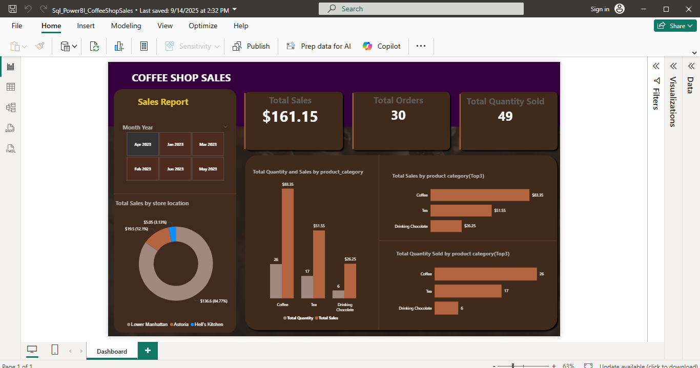

# Coffee Shop Sales Dashboard (SQL & Power BI)

## Project Overview
This project analyzes coffee shop sales data using SQL and Power BI.  
It shows how product category, store location, and time affect sales performance.  

## Tools Used
- SQL (data cleaning, aggregation, queries)  
- Power BI (charts, dashboards, visualization)

## Key Insights
- Certain products sold more in specific locations.  
- Sales increased during weekends and holidays.  
- Dashboards help track performance and trends easily.  

## Dashboard Preview

## Files in this Repository
- CoffeeShop_Sales.pbix → Power BI file with interactive dashboards.  
- CoffeeShop_Sales_Data.sql → SQL queries for cleaning and analysis.  
- Dashboard_Screenshot.png → Image preview of the dashboard
